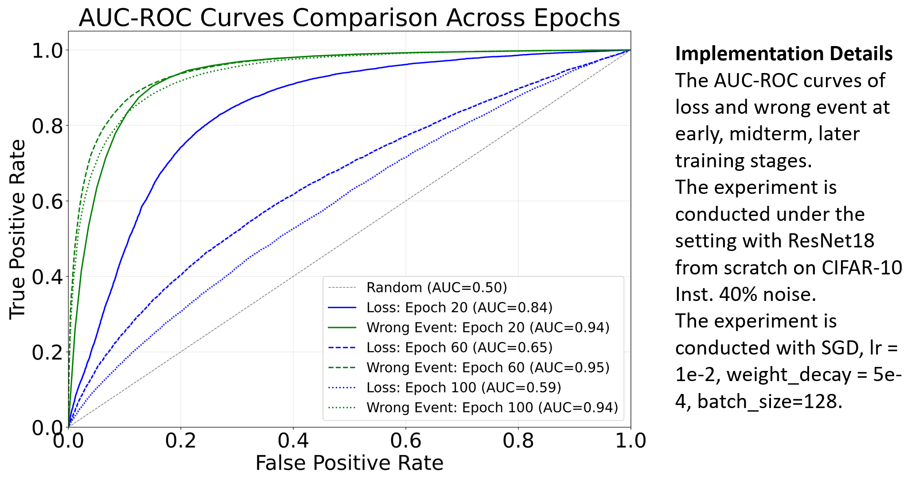

## 📊 Figures and Tables

### Table 1

<table border="1" cellspacing="0" cellpadding="5">
  <thead>
    <tr>
      <th colspan="2">Threshold</th>
      <th colspan="3">0.2</th>
      <th colspan="3">0.5</th>
      <th colspan="3">0.8</th>
      <th rowspan="10">Implementation Details</th>
    </tr>
    <tr>
      <td colspan="2">Epoch</td>
      <td>5</td>
      <td>20</td>
      <td>30</td>
      <td>5</td>
      <td>20</td>
      <td>30</td>
      <td>5</td>
      <td>20</td>
      <td>30</td>
    </tr>
  </thead>
  <tbody>
    <!-- Loss -->
    <tr>
      <td rowspan="3">Loss</td>
      <td>F-score</td>
      <td>0.49</td>
      <td>0.38</td>
      <td>0.29</td>
      <td>0.34</td>
      <td>0.29</td>
      <td>0.20</td>
      <td>0.00</td>
      <td>0.00</td>
      <td>0.00</td>
      <td rowspan="6">The precision, recall, F-score of Loss and Wrong Event. The experiment is conducted with ResNet18 on CIFAR10 under Inst. 40%.  We set three thresholds to calculate F-score. It is conducted with SGD, lr = 1e-2, weight_decay = 5e-4, batch_size=128.</td>
    </tr>
    <tr>
      <td>Precision</td>
      <td>0.62</td>
      <td>0.76</td>
      <td>0.79</td>
      <td>0.71</td>
      <td>0.79</td>
      <td>0.75</td>
      <td>0.92</td>
      <td>0.90</td>
      <td>0.60</td>
    </tr>
    <tr>
      <td>Recall</td>
      <td>0.41</td>
      <td>0.25</td>
      <td>0.18</td>
      <td>0.23</td>
      <td>0.18</td>
      <td>0.11</td>
      <td>0.00</td>
      <td>0.00</td>
      <td>0.00</td>
    </tr>
    <!-- Wrong Event -->
    <tr>
      <td rowspan="3">Wrong Event</td>
      <td>F-score</td>
      <td><b>0.60</b></td>
      <td><b>0.67</b></td>
      <td><b>0.70</b></td>
      <td><b>0.63</b></td>
      <td><b>0.70</b></td>
      <td><b>0.72</b></td>
      <td><b>0.70</b></td>
      <td><b>0.79</b></td>
      <td><b>0.76</b></td>
    </tr>
    <tr>
      <td>Precision</td>
      <td>0.43</td>
      <td>0.51</td>
      <td>0.54</td>
      <td>0.46</td>
      <td>0.54</td>
      <td>0.56</td>
      <td>0.63</td>
      <td>0.88</td>
      <td>0.93</td>
    </tr>
    <tr>
      <td>Recall</td>
      <td>0.99</td>
      <td>0.99</td>
      <td>0.99</td>
      <td>0.99</td>
      <td>0.99</td>
      <td>0.99</td>
      <td>0.77</td>
      <td>0.71</td>
      <td>0.65</td>
    </tr>
  </tbody>
</table>

### Table 2

<table border="1" cellspacing="0" cellpadding="5">
  <thead>
    <tr>
      <th colspan="2">Threshold</th>
      <th colspan="3">0.2</th>
      <th colspan="3">0.5</th>
      <th colspan="3">0.8</th>
      <th rowspan="10">Implementation Details</th>
    </tr>
    <tr>
      <td colspan="2">Epoch</td>
      <td>10</td>
      <td>30</td>
      <td>60</td>
      <td>10</td>
      <td>30</td>
      <td>60</td>
      <td>10</td>
      <td>30</td>
      <td>60</td>
    </tr>
  </thead>
  <tbody>
    <!-- Loss -->
    <tr>
      <td rowspan="3">Loss</td>
      <td>F-score</td>
      <td><b>0.77</b></td>
      <td>0.84</td>
      <td>0.56</td>
      <td>0.83</td>
      <td>0.61</td>
      <td>0.04</td>
      <td>0.05</td>
      <td>0.01</td>
      <td>0.00</td>
      <td rowspan="6">The precision, recall, F-score of Loss and Wrong Event.   The experiment is conducted with ResNet18 on CIFAR10 under Sym. 60%.  We set three thresholds to calculate F-score. It is conducted with SGD, lr = 1e-2, weight_decay = 5e-4, batch_size=128.</td>
    </tr>
    <tr>
      <td>Precision</td>
      <td>0.63</td>
      <td>0.75</td>
      <td>0.41</td>
      <td>0.81</td>
      <td>0.97</td>
      <td>0.94</td>
      <td>1.00</td>
      <td>1.00</td>
      <td>1.00</td>
    </tr>
    <tr>
      <td>Recall</td>
      <td>1.00</td>
      <td>0.96</td>
      <td>0.87</td>
      <td>0.85</td>
      <td>0.45</td>
      <td>0.02</td>
      <td>0.02</td>
      <td>0.00</td>
      <td>0.00</td>
    </tr>
    <!-- Wrong Event -->
    <tr>
      <td rowspan="3">Wrong Event</td>
      <td>F-score</td>
      <td>0.76</td>
      <td><b>0.85</b></td>
      <td><b>0.84</b></td>
      <td><b>0.85</b></td>
      <td><b>0.90</b></td>
      <td><b>0.92</b></td>
      <td><b>0.87</b></td>
      <td><b>0.92</b></td>
      <td><b>0.88</b></td>
    </tr>
    <tr>
      <td>Precision</td>
      <td>0.62</td>
      <td>0.76</td>
      <td>0.74</td>
      <td>0.73</td>
      <td>0.83</td>
      <td>0.89</td>
      <td>0.83</td>
      <td>0.93</td>
      <td>0.97</td>
    </tr>
    <tr>
      <td>Recall</td>
      <td>1.00</td>
      <td>0.97</td>
      <td>0.99</td>
      <td>0.99</td>
      <td>0.98</td>
      <td>0.96</td>
      <td>0.93</td>
      <td>0.92</td>
      <td>0.81</td>
    </tr>
  </tbody>
</table>

### Table 3

<table border="1" cellspacing="0" cellpadding="5">
  <thead>
    <tr>
      <th rowspan="2">Noise</th>
      <th colspan="3">Sym. 60%</th>
      <th colspan="3">Asym. 40%</th>
      <th colspan="3">Inst. 40%</th>
      <th rowspan="3">Implementation Details</th>
    </tr>
  </thead>
  <tbody>
    <tr>
      <td>Epoch</td>
      <td>20</td>
      <td>60</td>
      <td>100</td>
      <td>20</td>
      <td>60</td>
      <td>100</td>
      <td>20</td>
      <td>60</td>
      <td>100</td>
      <td rowspan="3">
        The AUC values of Loss and Wrong Event. The experiment is conducted with ResNet18 on CIFAR10 under Sym. 60%, Asym. 40%, Inst. 40%.
        It is conducted with SGD, lr = 1e-2, weight_decay = 5e-4, batch_size=128.
      </td>
    </tr>
    <tr>
      <td>Loss</td>
      <td>0.95</td>
      <td>0.80</td>
      <td>0.63</td>
      <td>0.80</td>
      <td>0.64</td>
      <td>0.58</td>
      <td>0.84</td>
      <td>0.65</td>
      <td>0.59</td>
    </tr>
    <tr>
      <td>Wrong Event</td>
      <td><b>0.96</b></td>
      <td><b>0.98</b></td>
      <td><b>0.97</b></td>
      <td><b>0.94</b></td>
      <td><b>0.94</b></td>
      <td><b>0.92</b></td>
      <td><b>0.94</b></td>
      <td><b>0.95</b></td>
      <td><b>0.94</b></td>
    </tr>
  </tbody>
</table>

### Figure 1

			
    
	
    
     		
    

### Table 4

<table border="1" cellspacing="0" cellpadding="5">
  <thead>
    <tr>
      <th>Method</th>
      <th>Accuracy(%)</th>
      <th>Per Epoch Time(s)</th>
      <th>Per Epoch BMM Time(s)</th>
      <th rowspan="2">Implementation Details</th>
    </tr>
  </thead>
  <tbody>
    <tr>
      <td>IDO(BMM)</td>
      <td>83.6</td>
      <td>121</td>
      <td>4.6</td>
      <td rowspan="2">
        The results of IDO(BMM). The experiment is conducted under the setting with ResNet50 on CIFAR-100 with Inst. 40% noise,
        with AdamW, lr = 1e-3, weight_decay = 1e-5, batch_size=64. 
        The experiment was performed on a single A100 80GB, repeated 5 times.
      </td>
    </tr>
  </tbody>
</table>

### Table 5

<table border="1" cellspacing="0" cellpadding="5">
  <thead>
    <tr>
      <th>Method</th>
      <th>Accuracy(%)</th>
      <th>Per Epoch Time(s)</th>
      <th>Per Epoch Fitting Time(s)</th>
      <th rowspan="4">Implementation Details</th>
    </tr>
  </thead>
  <tbody>
    <tr>
      <td>M-Correction(BMM)</td>
      <td>78.9</td>
      <td>399</td>
      <td>14.7</td>
      <td rowspan="4">
        The results of M-Correction(BMM), DivideMix(GMM), and IDO(BMM).  
        The experiment is conducted under the setting with ResNet50 on CIFAR-100 with Inst. 40% noise, using AdamW, lr = 1e-3, weight_decay = 1e-5, and batch_size=64.  
        The experiment was performed on a single A100 80GB, repeated 5 times.
      </td>
    </tr>
    <tr>
      <td>DivideMix(GMM)</td>
      <td>81.3</td>
      <td>457</td>
      <td>19.5</td>
    </tr>
    <tr>
      <td>IDO(BMM)</td>
      <td><b>83.6</b></td>
      <td><b>121</b></td>
      <td><b>4.6</b></td>
    </tr>
  </tbody>
</table>

