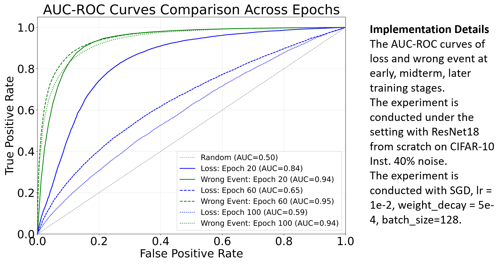

## 📊 Figures and Tables

### Table 1

<table border="1" cellspacing="0" cellpadding="5">
  <thead>
    <tr>
      <th rowspan="2">Noise</th>
      <th colspan="3">Sym. 60%</th>
      <th colspan="3">Asym. 40%</th>
      <th colspan="3">Inst. 40%</th>
      <th rowspan="3">Implementation Details</th>
    </tr>
  </thead>
  <tbody>
    <tr>
      <td>Epoch</td>
      <td>20</td>
      <td>60</td>
      <td>100</td>
      <td>20</td>
      <td>60</td>
      <td>100</td>
      <td>20</td>
      <td>60</td>
      <td>100</td>
      <td rowspan="3">
        The AUC values of Loss and Wrong Event. The experiment is conducted with ResNet18 on CIFAR10 under Sym. 60%, Asym. 40%, Inst. 40%.   
        It is conducted with SGD, lr = 1e-2, weight_decay = 5e-4, batch_size=128.
      </td>
    </tr>
    <tr>
      <td>Loss</td>
      <td>0.95</td>
      <td>0.80</td>
      <td>0.63</td>
      <td>0.80</td>
      <td>0.64</td>
      <td>0.58</td>
      <td>0.84</td>
      <td>0.65</td>
      <td>0.59</td>
    </tr>
    <tr>
      <td>Wrong Event</td>
      <td><b>0.96</b></td>
      <td><b>0.98</b></td>
      <td><b>0.97</b></td>
      <td><b>0.94</b></td>
      <td><b>0.94</b></td>
      <td><b>0.92</b></td>
      <td><b>0.94</b></td>
      <td><b>0.95</b></td>
      <td><b>0.94</b></td>
    </tr>
  </tbody>
</table>

### Table 2

<table border="1" cellspacing="0" cellpadding="5">
  <thead>
    <tr>
      <th rowspan="2">Noise</th>
      <th colspan="3">Sym. 60%</th>
      <th colspan="3">Asym. 40%</th>
      <th colspan="3">Inst. 40%</th>
      <th rowspan="4">Implementation Details</th>
    </tr>
  </thead>
  <tbody>
    <tr>
      <td>Epoch</td>
      <td>20</td>
      <td>60</td>
      <td>100</td>
      <td>20</td>
      <td>60</td>
      <td>100</td>
      <td>20</td>
      <td>60</td>
      <td>100</td>
      <td rowspan="4">
        The AUC values of Loss and Wrong Event. The experiment is conducted with ResNet18 on CIFAR100 under Sym. 60%, Asym. 40%, Inst. 40%.   
        It is conducted with SGD, lr = 1e-2, weight_decay = 5e-4, batch_size=128.
      </td>
    </tr>
    <tr>
      <td>Loss</td>
      <td>0.85</td>
      <td>0.69</td>
      <td>0.60</td>
      <td>0.62</td>
      <td>0.56</td>
      <td>0.55</td>
      <td>0.79</td>
      <td>0.61</td>
      <td>0.59</td>
    </tr>
    <tr>
      <td>Wrong Event</td>
      <td><b>0.87</b></td>
      <td><b>0.92</b></td>
      <td><b>0.91</b></td>
      <td><b>0.72</b></td>
      <td><b>0.75</b></td>
      <td><b>0.74</b></td>
      <td><b>0.86</b></td>
      <td><b>0.88</b></td>
      <td><b>0.88</b></td>
    </tr>
  </tbody>
</table>

### Figure 1

			
    
	
    
     		
    

